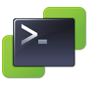

<h1 align="center">
   
    
   
  vscode-powercli
   
   
</h1>

<h4 align="center">Adds PowerShell Code Snippets for VMware PowerCLI</h4>

# vscode-powercli README

This is the README for the VSCode extension "vscode-powercli". 

## Features

The inital release of the VSCode PowerCLI Extension only containes Code Snippets.

### Snippets

#### VMware vSphere vCenter Connection

#### VMware ESXi Get-ESXCLI -V2

#### For each ESXi Host in Cluster

#### Get VM Metric Stats
